# Eureka Results

This document presents the results of running Eureka on three different tasks, plus a visualization of a pre-trained pen spinning demo.

## Quick summary
- AllegroHand: performance seems bad
- Humanoid: We see signs of iterative improvement
- ShadowHand: Only one instance of global improvement

## Navigation
- [AllegroHand Task](#allegrohand-task)
- [Humanoid Task](#humanoid-task)
- [ShadowHand Task](#shadowhand-task)
- [ShadowHand Pen Spinning Demo](#shadowhand-pen-spinning-demo)

## AllegroHand Task

### Performance Plot
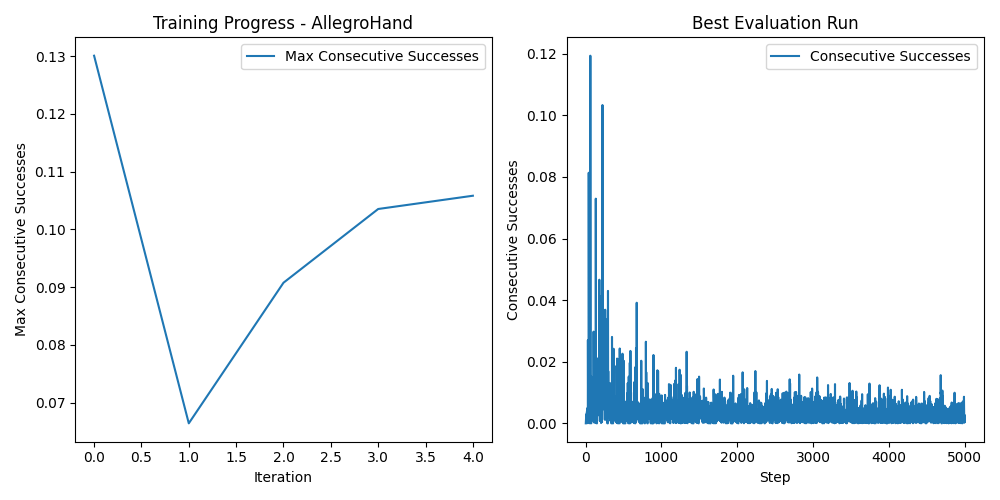

### Videos
#### Evaluation Run
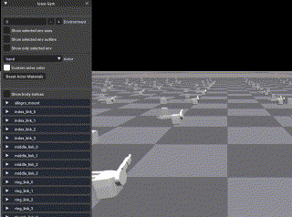

#### Training Progress (Iterations 0-4)
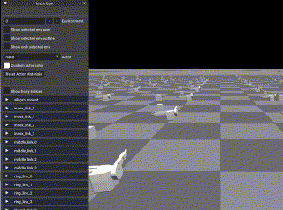  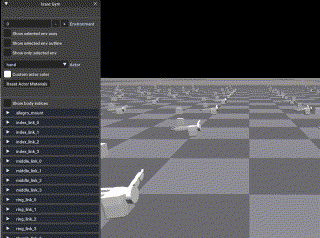 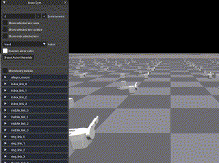 

## Humanoid Task

### Performance Plot
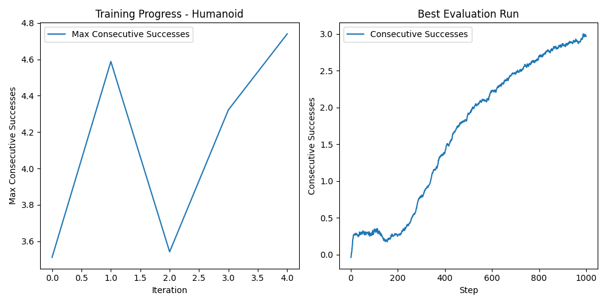

### Videos
#### Evaluation Run
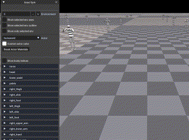

#### Training Progress (Iterations 0-4)
 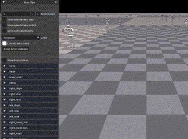   

## ShadowHand Task

### Performance Plot
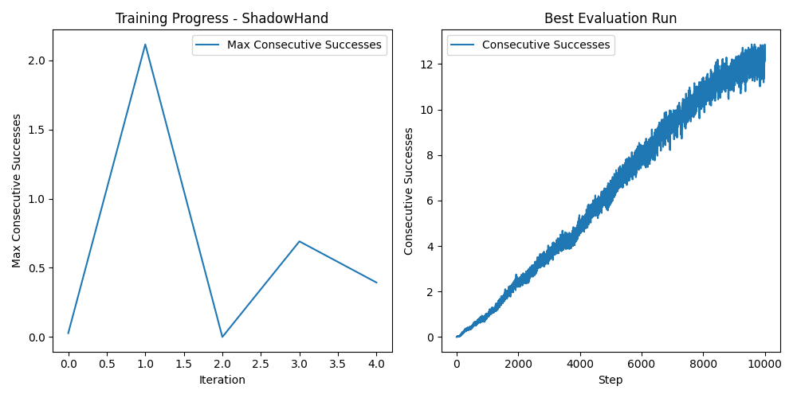

### Videos
#### Evaluation Run

#### Training Progress (Iterations 0-4)
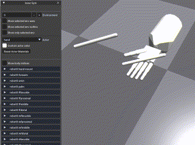   

## ShadowHand Pen Spinning Demo
This is a visualization of the pre-trained pen spinning demo, rather than a result from training.

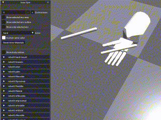
